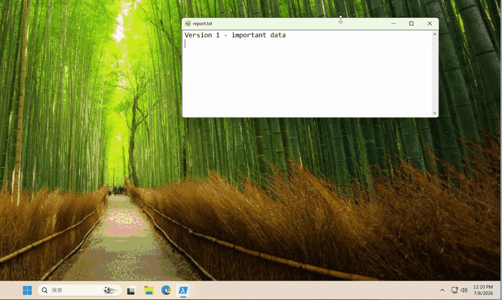

# FileHistoryClone


[日本語版 README はこちら / Japanese README](README.ja.md)

**Every version of every file, saved automatically — as plain files you can open in Explorer.**

FileHistoryClone is a lightweight, tray-resident backup tool that revives the spirit of Windows "File History": it watches the folders you choose and keeps a timestamped copy every time a file changes. Accidentally overwrote a document three days ago? Just pick the version from before the mistake and restore it.

- 🕘 **Continuous, not scheduled** — changes are detected in real time; nothing to remember to run
- 📂 **No proprietary format** — every backup is an ordinary file (`report(2026_07_07 09_30_00).docx`) you can open directly, even without this app
- 🪶 **Stays out of your way** — heavy scanning runs only while your PC is idle, on lowest-priority threads
- 🔒 **100% local & private** — no cloud, no account, no subscription, no telemetry



## Quick start

**Option A — download:** from [Releases](../../releases), run the installer (`FileHistoryCloneSetup-*.exe`, per-user, no admin) — or grab a portable zip (`-standalone` needs no .NET runtime), unzip, and run `FileHistory.exe`.

**Option B — build from source:**

```powershell
git clone https://github.com/tomoyukioya/FileHistoryClone.git
cd FileHistoryClone
dotnet run --project FileHistory\FileHistory.csproj -c Release
```

When installed from the installer, the app lives in `%LOCALAPPDATA%\Programs\FileHistoryClone`. It sits in the system tray and, out of the box, protects your `Documents` folder, saving versions to `%USERPROFILE%\FileHistoryCloneBackup`. To choose your own folders and tune backup settings, edit the [appsettings.json](FileHistory/appsettings.json) next to the app (see [appsettings.example.json](FileHistory/appsettings.example.json) for a fully annotated example).

## Motivation

Windows 8 introduced [File History](https://support.microsoft.com/en-us/windows/file-history-in-windows-5de0e203-ebae-05ab-db85-d5aa0a199255), a wonderfully simple "set it and forget it" feature: point it at a drive, and every version of every document is kept automatically. Unfortunately, Microsoft has effectively stopped maintaining it — it was removed from the Settings app in favor of OneDrive, long-standing bugs (silently stopped backups, files skipped without notice) remain unfixed, and its future in Windows is uncertain.

FileHistoryClone is an attempt to keep that idea alive as an independent open-source tool: continuous, versioned, local backups stored as plain files — no proprietary container, no cloud dependency, no subscription.

## Features

- **Real-time backup** — detects file creation/modification with `FileSystemWatcher` and schedules a backup automatically.
- **Background crawling** — periodically scans the watched folders to catch anything the watcher missed. Crawling runs only while the PC is idle (configurable idle threshold) and on lowest-priority threads, so it stays out of your way.
- **Versioned backups** — each backup is stored as a plain file named `original(yyyy_MM_dd HH_mm_ss).ext`, mirrored under the backup root. No proprietary container: you can open backups directly in Explorer.
- **Catalog database** — file/generation metadata is tracked in an embedded [LiteDB](https://www.litedb.org/) database.
- **Restore UI** — browse backed-up folders in a tree, pick any generation of a file, and restore files or whole directories (timestamps are preserved).
- **Retention policy** — optionally cap generations per file (`MaxGenerations`) and/or delete backups older than N days (`RetentionDays`). The newest generation is always kept.
- **Manual cleanup** — one-click cleanup modes: "keep only the latest of all files" / "keep only the latest of existing files".
- **Flexible filtering** — per-directory backup intervals, glob-style exclude patterns (`.git`, `*.tmp`, `C:\Users\me\AppData`, ...), re-include exceptions (`!important.log`), and environment-variable expansion (`%USERPROFILE%\Documents`) in all configured paths.
- **Localized UI** — English and Japanese included; follows the OS language or can be forced via the `Language` setting.

## Requirements

- Windows 10/11
- [.NET 8 SDK](https://dotnet.microsoft.com/download/dotnet/8.0) (or newer) to build

## Using the tray icon

The app starts minimized to the system tray. Right-click the tray icon for:

| Menu | Action |
| --- | --- |
| Open | Open the restore window (double-click works too) |
| Open Settings | Open `appsettings.json` in your editor |
| Start with Windows | Toggle automatic start at logon |
| Exit | Quit the application |

## Configuration (`appsettings.json`)

**To change which folders are protected**, edit `appsettings.json`. The easiest way is the tray icon → **Open Settings** (or, if you used the installer, the Start-menu shortcut **Edit FileHistoryClone settings**). After editing, **restart the app** (tray → Exit, then launch again) to apply.

Where the file lives:

| How you run it | Location of `appsettings.json` |
| --- | --- |
| Installer | `%LOCALAPPDATA%\Programs\FileHistoryClone\appsettings.json` |
| Portable zip | next to `FileHistory.exe` |

All paths support environment-variable expansion (e.g. `%USERPROFILE%\Documents`).

| Key | Description |
| --- | --- |
| `BackupBaseDir` | Root folder for backups. Data goes to `{BackupBaseDir}\{User}\{Machine}\Data` |
| `DefaultBackupInterval` | Minimum seconds between two backups of the same file |
| `IncludeDirs` | Folders to protect. Each entry may override `BackupInterval`; the longest matching path wins |
| `ExcludeDirs` | Exclude patterns: absolute paths, names matched at any depth (`.git`), globs (`*.tmp`), re-include exceptions (`!important.log`), and `#`-prefixed comments |
| `CrawlingInterval` | Seconds to wait after a full crawl before the next one |
| `CrawlingIdleTimer` | Seconds of user inactivity required before crawling runs |
| `Language` | UI language (`"en"`, `"ja"`); empty = follow the OS |
| `MaxGenerations` | Max backup generations per file (0 = unlimited) |
| `RetentionDays` | Delete backups older than N days, newest always kept (0 = unlimited) |
| `RetentionScanInterval` | Seconds between retention-policy scans |

See [appsettings.example.json](FileHistory/appsettings.example.json) for a commented template.

## How it works

```
┌──────────────────┐   change events   ┌─────────────────┐   copy tasks   ┌────────────┐
│ DirectoryWatcher ├──────────────────►│                 ├───────────────►│ CopyWorker │
└──────────────────┘   (high priority) │ BackupScheduler │                └─────┬──────┘
┌──────────────────┐                   │  (time-ordered  │                      ▼
│ Crawler          ├──────────────────►│   queues)       │               backup files +
└────────┬─────────┘   (low priority)  └─────────────────┘               LiteDB catalog
         │ runs only while idle
┌────────┴─────────┐
│ IdleTimeWatcher  │
└──────────────────┘
```

- **DirectoryWatcher** reacts to file system events and enqueues high-priority backup requests.
- **Crawler** walks the include directories on lowest-priority threads and enqueues anything not yet backed up.
- **BackupScheduler** waits until a file has been stable for its backup interval, deduplicates, and copies with up to 10 concurrent workers. Failed copies are rolled back.
- **RetentionWorker** periodically applies the retention policy.
- The catalog (`Catalog.db`) maps directories/files to their backup generations and timestamps.

## Repository layout

| Project | Description |
| --- | --- |
| `FileHistory` | The main tray application |
| `FileHistoryTests` | MSTest unit/integration tests |

## Similar projects

If FileHistoryClone doesn't fit your needs, these open-source alternatives may:

| Project | Approach | Difference from FileHistoryClone |
| --- | --- | --- |
| [Home Backup & Restore](https://github.com/osmanonurkoc/home_backup_restore) | Time Machine-like snapshots with NTFS hard links (PowerShell + WPF) | Snapshot-based (run on demand/schedule); FileHistoryClone backs up continuously as files change |
| [Kopia](https://github.com/kopia/kopia) | Scheduled snapshots with dedup, compression, encryption | Powerful but stores data in its own repository format; not per-file plain copies |
| [Restic](https://github.com/restic/restic) | CLI snapshot backup, encrypted repository | CLI-oriented, snapshot-based, proprietary repo layout |
| [Duplicati](https://github.com/duplicati/duplicati) | Scheduled backup to local/cloud targets | Schedule-based; archives data in blocks rather than browsable plain files |

FileHistoryClone's niche: **event-driven, continuous, per-file versioning stored as plain files** you can browse in Explorer — the closest in spirit to the original Windows File History.

## Known limitations

- Local drive letters only — UNC paths (`\\server\share`) are not supported as include dirs.
- No Volume Shadow Copy: files exclusively locked by other processes cannot be backed up while locked.
- Backups are neither compressed nor encrypted (they are plain copies).
- Windows only (WinForms + Win32 idle detection).

## Contributing

Bug reports, feature requests, and pull requests are all welcome — including translations (one `Strings.<lang>.resx` file, no code changes) and documentation fixes. See [CONTRIBUTING.md](CONTRIBUTING.md) for setup and guidelines, and [CHANGELOG.md](CHANGELOG.md) for release history.

If FileHistoryClone saved one of your files, consider giving the repo a ⭐ — it helps other people find it.

## License

[MIT](LICENSE)
